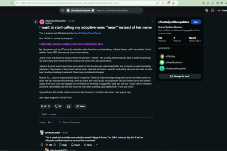

# Reddit Summarizer Chrome Extension

##  Description
This project is a Chrome extension that automatically summarizes top Reddit comments from a given post. The extension leverages the Reddit API to fetch comments and OpenAI's GPT model to provide a natural language summary. The backend is built with FastAPI and deployed on AWS Lambda using Docker for scalability.

  

## How to run
To use the project on your own, follow these steps:
1. **Register Reddit Script**: Create a Reddit script app to obtain your `CLIENT_ID`, `CLIENT_SECRET`, and `USER_AGENT` keys for API access
2. **Register for OpenAI API**: Sign up for OpenAI API access and retrieve your `SECRET_KEY` for GPT access
3. **Configure Environment Variables**: Load your environment variables into `popup.js` for your local extension setup
4. **Deploy Backennd**: Use the provided `Dockerfile` to containerize the backend files under the `app/` directory
5. **Push to AWS Lambda**: Push the Docker image to AWS Lambda and update teh `apiURL` to point to your deployed backend

## Future Work
Modify the extension to inject the summary directly into the Reddit post page, manipulating the DOM, instead of displaying it in a popup.
